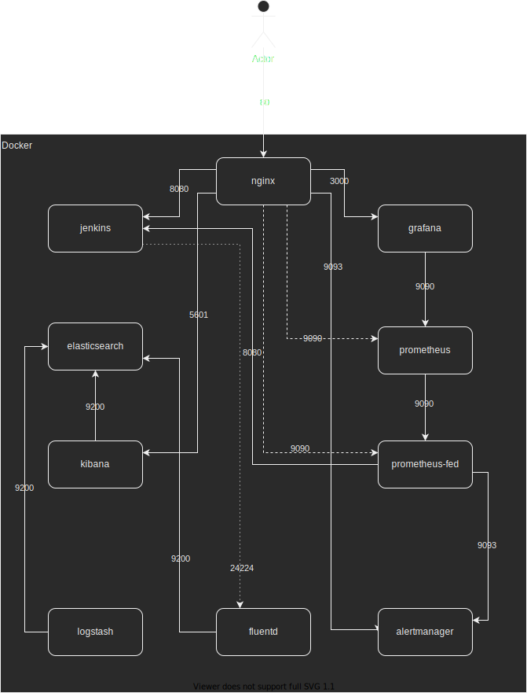

# Grauss on Docker Compose

## Introduction

In this project we want to demonstrate the grauss project, which lays the foundation that a devops team would need.

## Requirements

Docker requirements:

- CPU: 2
- Memory: 8GB

### Docker Daemon

Change the docker daemon:

```
{
  "metrics-addr" : "127.0.0.1:9323",
  "experimental" : true
}
```

## Install

Add to /etc/hosts file:
```
127.0.0.1 alertmanager.grauss.local grafana.grauss.local jenkins.grauss.local kibana.grauss.local prometheus-fed.grauss.local prometheus.grauss.local
```

Use Docker Compose to install this solution

```
$ docker-compose up -d
```

## Diagram



### Access
Urls:

| App | URL | User | Pass |
|-----|-----|------|------|
|Kibana|[http://kibana.grauss.local](http://kibana.grauss.local)| elastic | changeme |
|Grafana|[http://grafana.grauss.local](http://grafana.grauss.local)| admin |admin|
|Prometheus|[http://prometheus.grauss.local](http://prometheus.grauss.local)| | |
|Prometheus Federated|[http://prometheus-fed.grauss.local](http://prometheus-fed.grauss.local) | |
|Alertmanager|[http://alertmanager.grauss.local](http://alertmanager.grauss.local) | |
|Jenkins|[http://jenkins.grauss.local](http://jenkins.grauss.local)| | |

#### Jenkins
To get the pass:

```
$ docker-compose logs -f jenkins
```

### Docker Images

* [Nginx](https://hub.docker.com/_/nginx)
* [ElasticSearch](https://hub.docker.com/_/elasticsearch)
* [Kibana](https://hub.docker.com/_/kibana)
* [Logstash](https://hub.docker.com/_/logstash)
* [Filebeat](https://hub.docker.com/r/elastic/filebeat)
* [Grafana](https://hub.docker.com/r/grafana/grafana)
* [Prometheus](https://hub.docker.com/r/prom/prometheus)
* [Alertmanager](https://hub.docker.com/r/prom/alertmanager)
* [Jenkins](https://hub.docker.com/r/jenkins/jenkins)
* [Fluentd](https://hub.docker.com/_/fluentd)
